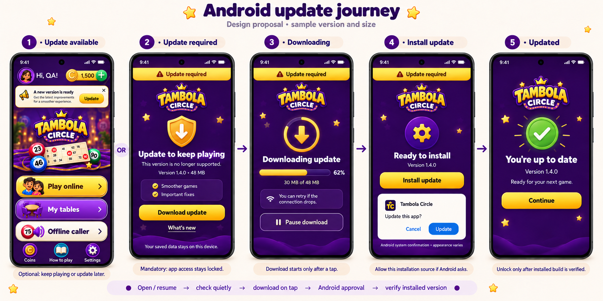
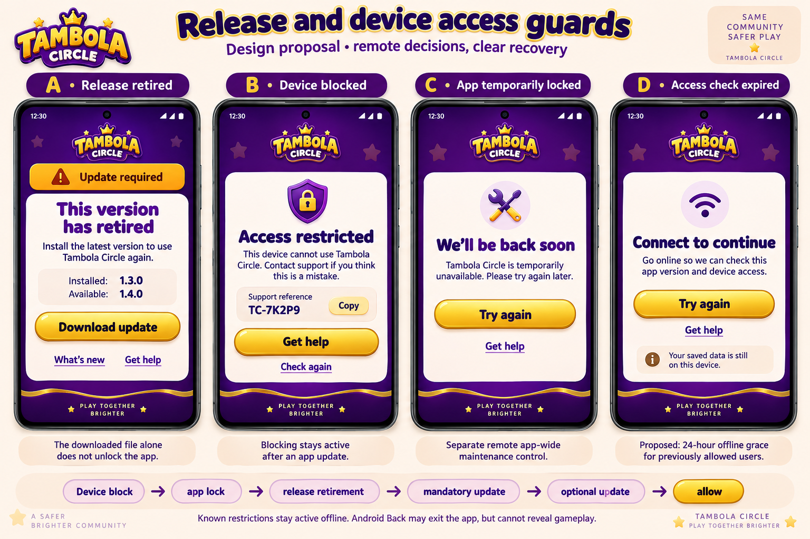
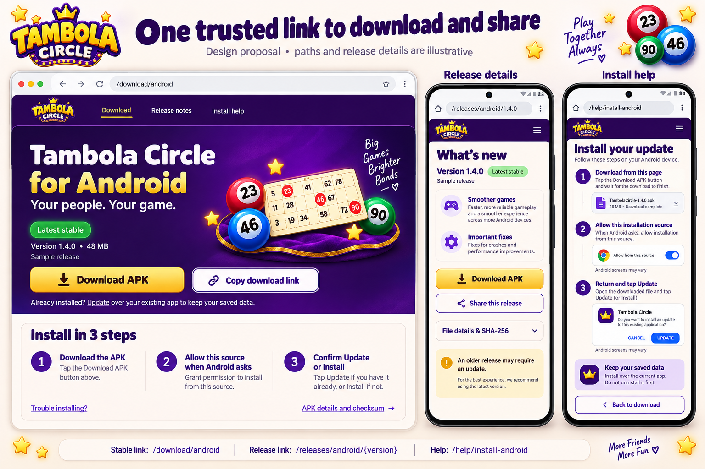

# Android update design review

Prepared 23 September 2026. **Proposal only: no feature code or live policy has been changed.**

Start with the three workflow boards, then the [implementation and feasibility plan](PLAN.md). The [screen specification](SCREEN_SPEC.md) is the exact behavioral reference; generated art is a visual direction.

| Board | Includes |
|---|---|
| [01 — Android update journey](images/01-update-journey.png) | Optional banner, mandatory gate, transfer, Android confirmation, verified success |
| [02 — Access guards](images/02-access-guards.png) | Retired release, blocked device, app-wide lock, expired offline access |
| [03 — Download and share pages](images/03-download-pages.png) | Desktop download landing page, mobile release details and installation help |

## Review notes

- Purple/gold colors, rounded headings and Tambola Circle artwork follow the existing app. Home actions remain Play online, My tables, Offline caller, Coins, How to play and Settings.
- Optional and mandatory updates are alternate policy outcomes. They are not successive steps every user must see.
- Mandatory update, release retirement and device block are separate states. Downloading alone never unlocks the app; an update never removes a device block.
- All release values in the images are illustrative. The actual current APK inspected is 1.3.0 / build 8 and about 86 MB.
- The offline grace shown is a provisional 24-hour proposal, pending preference. Known denies remain in force.
- Native Android screens vary by version/device and remain controlled by Android.
- Decorative taglines in generated artwork are not approved product copy. Use SCREEN_SPEC.md for implementation text.
- Pages and paths shown are proposed, not deployed share links. Production domain, help destination and Cloudflare billing/usage must be resolved before launch.
- No admin panel is being built in this pass. The plan includes app states and the remote contract that a future panel can control.

Generated with the built-in image generation tool. Full prompts and the targeted home-screen refinement are in [IMAGE_PROMPTS.md](IMAGE_PROMPTS.md). Final images live in this D: workspace.
