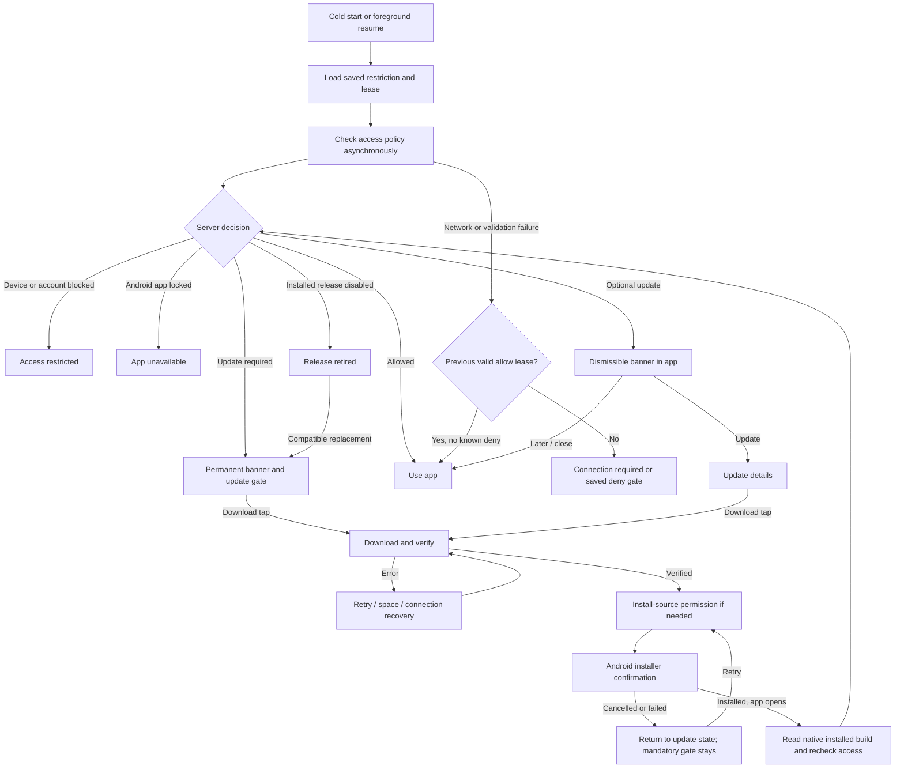

# Screen and workflow specification

Design v1, Android only. Behavioral requirements take precedence over illustrative details in image boards.

## App-level workflow

A valid cached allow may render the normal app while the async check runs. Known restrictions or absent/expired leases must gate before interactive screens mount. Never show a full-screen checking step on every successful resume when a valid lease already permits access.

## Exact primary copy and controls

| State | Headline / primary copy | Controls | Dismissible? |
|---|---|---|---|
| Optional banner | A new version is ready | Update; close icon | Yes, for that release only |
| Update detail | Update Tambola Circle | Download update; What’s new; Back when optional | Optional only |
| Mandatory gate | Update to keep playing / This version is no longer supported. | Download update; What’s new; Get help | No |
| Downloading | Downloading update | Pause download; real bytes/total and percent | Optional details may close; mandatory app gate may not |
| Paused | Download paused | Resume download | Same access rule as parent update |
| Network failed | Download interrupted / Check your connection and try again. | Retry download; Get help | Same access rule as parent update |
| Space failed | More space needed / Free up space on this device, then try again. | Try again; Get help | Same access rule as parent update |
| Integrity failed | We couldn’t verify this download. / Download a fresh copy to continue. | Download again; Get help | Never install the failed file |
| Verified download | Ready to install | Install update | Mandatory gate remains |
| Source permission needed | Allow updates from Tambola Circle / Android will ask you to allow installation from this source. | Open Android settings; Get help | Android controls permission |
| Installer cancelled | Update not installed / Tap Install update when you’re ready. | Install update; Get help | Mandatory gate remains |
| Installed and allowed | You’re up to date / Ready for your next game. | Continue | Allowed normal app afterward |
| Retired release | This version has retired / Install the latest version to use Tambola Circle again. | Download update; What’s new; Get help | No |
| No compatible replacement | This version is no longer supported. / A compatible update isn’t available for this device. | Check again; Get help | No broken download CTA |
| Device/account block | Access restricted / This device cannot use Tambola Circle. Contact support if you think this is a mistake. | Get help; Check again; Copy support reference | No |
| App lock | We’ll be back soon / Tambola Circle is temporarily unavailable. Please try again later. | Try again; Get help | No |
| Access lease expired | Connect to continue / Go online so we can check this app version and device access. | Try again; Get help | No |
| First check | Checking app access | Retry/help on failure | Do not classify a failure as a ban |

Every mandatory update screen has a persistent **Update required** banner without an X. Android Back may exit the activity; it cannot reveal the gated app. Installer Cancel is a system action and returns to the gate.

Update details show native installed version, target version, download size, release notes and compatibility. Technical file details are secondary. Dynamic release text is bounded and rendered as plain text. Never show raw device identifiers, credentials or internal moderation notes to the user; support uses an opaque reference.

The “Get help” destination must be a maintained app/web help route or existing support channel chosen at implementation. No invented email address or nonfunctional contact button.

## Layout and accessibility

- Preserve current home structure and artwork. Put the optional banner below the greeting, reducing the flexible hero area so existing actions remain reachable.
- Put gates above all routes, modal sheets, registration, deep links and caller screens. A translucent overlay alone is insufficient.
- Reuse purple #31065b, cream #fff7f2, gold CTA treatment and existing Fredoka heading fonts. Use readable body text; do not depend on color alone.
- Gates scroll on small screens and at large font sizes. Keep status/navigation-bar insets and a visible primary CTA.
- Use minimum 48dp touch targets, screen-reader labels and focus on the gate headline. Announce major progress milestones without continuous percent chatter.
- Respect reduced motion. Keep the update policy text and controls legible over decorative artwork.
- The device-block screen stays calm and neutral; do not claim a user is malicious.
- Optional updates do not interrupt active calling or repeatedly steal focus. Mandatory gating pauses local calls and actions without deleting saved state.

## Web pages

**Download landing page:** brand header; latest stable badge; actual version/size/Android compatibility; Download APK; Copy download link; release notes; three installation steps; file details/checksum; help link. No sign-in required.

**Release detail:** version, build code, date, notes, compatibility, file information and Share this release. For retired/revoked releases replace the old download CTA with View latest version and a clear retirement notice. Exact version/build URLs remain useful after retirement.

**Install help:** distinguish downloading in a browser from downloading in Tambola Circle; installation permission belongs to the initiating source. Show platform-dependent examples as illustrations. Explain in-place update, cancellation, space, connection, incompatible Android and signature conflicts. Never tell users to uninstall to solve an update.

**Unavailable states:** no release published, temporarily unavailable APK, unsupported Android device and retired shared link all need explicit copy and recovery. Do not silently return a broken download.

## Interaction invariants

1. Closing an optional offer does not alter server access policy.
2. Pausing/cancelling a download does not lift a mandatory requirement.
3. Opening permission settings, returning from installer, or downloading 100% does not prove installation.
4. A new build must be read from native package metadata; JS package version is not authoritative.
5. A device block survives an otherwise successful update until the server allows access again.
6. An older in-flight response cannot replace a newer policy decision or another identity’s state.
7. A retry never clears a known restriction just because the network failed.
8. Offline grace is measured from a successful allow check, not repeatedly extended by failed attempts.
9. Normal app screens, cached deep links and active sockets cannot escape the same gate/enforcement policy.
10. App data is preserved through every gate and recovery state.

## Open design inputs

The 24-hour grace period is provisional. Public domain and real support destination are deployment inputs. A graphical admin panel is deferred; its authenticated operations and audit contract are covered in PLAN.md.
