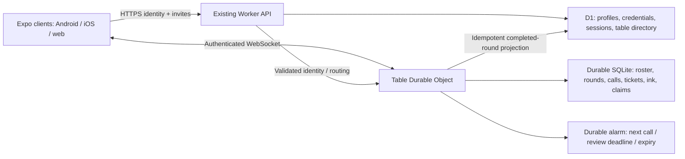

# Implementation plan — private online play

Scope: implement after the UI and unresolved game rules are approved. This delivery contains design documents and images only. Public tables remain disabled. No deployment, account-provider purchase or production migration was performed.

## 1. What the current code supports

Atlas indexed this workspace on 21 September 2026 and supplied these code citations. The initial index was cold; later queries returned indexed context. Broad multiplayer queries also matched generated Cloudflare type declarations, which are **not an implemented room server**. Atlas did not return useful test inventory; a scoped file inventory and package manifests supplemented the code study.

| Existing capability | Evidence | Consequence |
| --- | --- | --- |
| Home with Start/Resume, settings, share and account | [HomeScreen.tsx:30](../../src/components/HomeScreen.tsx#L30) | Add online entry while retaining offline caller |
| Only home/caller routing; local caller timer and app-background pause | [App.tsx:13](../../App.tsx#L13) | Introduce explicit online routes/state; do not reuse the local timer as multiplayer authority |
| Local draw without repetition and bounded random selection | [game.ts:4](../../src/game.ts#L4), [game.ts:19](../../src/game.ts#L19) | Extract pure number rules to shared code; supply server cryptographic randomness online |
| Caller display and number history | [CallerScreen.tsx:18](../../src/components/CallerScreen.tsx#L18) | Reuse visual pieces; keep offline controls separate |
| Plum/gold SVG branding; decorative ticket artwork | [Artwork.tsx:28](../../src/components/Artwork.tsx#L28), [Artwork.tsx:56](../../src/components/Artwork.tsx#L56) | Preserve identity; the decorative ticket is not a gameplay model/generator |
| Guest + username/password + recovery accounts, preference HTTP endpoints | [server/src/index.ts:84](../../server/src/index.ts#L84) | Extend identity through versioned endpoints; preserve existing accounts |
| Hashed server sessions | [server/src/index.ts:77](../../server/src/index.ts#L77) | Reuse session patterns with device-credential lifecycle |
| Preference syncing and authentication lifecycle | [useAppState.ts:8](../../src/useAppState.ts#L8) | Keep account/local state separate from a new online-table store |
| SecureStore on native; AsyncStorage identity on web | [storage.ts:43](../../src/storage.ts#L43) | Reuse native storage; assess secure web-session handling for online mode |
| Local voice player | [useVoice.ts:9](../../src/useVoice.ts#L9) | Announce accepted server calls; replay history locally without drawing |

Manifest inspection: Expo 57, React Native 0.86, React 19, TypeScript; React Native SVG is present. The backend is a Cloudflare Worker with D1 migrations and Wrangler. Existing tests cover draws, call phrases, announcement playback and voice assets. Package scripts include typecheck, test, test:api and web/native export. No operational ticket generator, online table implementation or multiplayer test suite appeared in the scoped application inventory.

The working tree already contains substantial app, artwork and voice edits. Implementation must start from the user's intended checkout, preserve those edits and reread each target before changing it.

## 2. Recommended architecture

Extend the existing Worker and D1 deployment. Add **one SQLite-backed Durable Object per table** as the authority for membership, rounds, calls, ticket revisions, strokes and claims. This is a proposed architecture, not an existing capability.

Cloudflare documents coordinated multiplayer WebSockets and recommends its [hibernation API](https://developers.cloudflare.com/durable-objects/best-practices/websockets/). Use durable storage as the source of truth after eviction. [Alarms](https://developers.cloudflare.com/durable-objects/api/alarms/) provide persisted scheduling; handlers must tolerate retries. One table owns one alarm, so schedule the earliest due task and dispatch by type. Do not use a global room object or client intervals to determine online calls.

D1 stores identity and lookup data; the table object owns live game transactions. D1 result/history writes are retryable projections, never a second competing live state. Keep authentication secrets out of table broadcasts. An active eight-second game will wake frequently; hibernation mainly helps idle lobbies and paused/quiet periods. Measure actual costs; no cost estimate is promised here.

## 3. State machines and invariants

Table: open → closing → closed/expired.

Round: lobby → countdown → running → reviewing → running or completed. An unresolved/abandoned review can end without a winner under the agreed rule.

Player round status: choosing → ready → active → spectator/disqualified → reset for next round.

Core invariants:

- Only registered, authenticated, admitted members receive private table data.
- Visibility public is rejected by the server in v1, even if a modified client submits it.
- Every participating player has exactly one selected ticket at start; all ready states refer to the current ticket and rule revisions.
- Only the server selects the next uncalled number from 1–90.
- A committed declaration and its frozen evidence prevent a subsequent draw until resolution.
- Every mutation checks table, round, actor, authorization, state version and idempotency key.
- Only the ticket owner may add/erase/undo marks; spectators cannot mutate gameplay.
- Disqualification survives disconnect, leave/rejoin and app restart for that profile/round.
- Snapshots and event replay converge; clients cannot overwrite the server with a stale local state.

## 4. Identity and mobile migration

Follow [the feasibility decision](PHONE_VERIFICATION.md). Proposed default is a registered device identity with name/mobile metadata, not phone-only authentication.

Extend profiles with display_name, phone_e164, phone_source, phone_verification_status, phone_verified_at and avatar seed/reference. Use UUID player IDs. Add device_credentials and separately hashed recovery credentials; reuse/extend sessions with revocation. Keep unverified phone non-unique and never merge by it.

Add a versioned registration flow. Upgrade an existing authenticated guest/user transactionally, retaining its profile ID and preferences. Existing users may still authenticate with username/password, then add the required online profile fields. Device credential exchanges issue scoped sessions; rotate secrets appropriately. Recovery is single-use and revokes prior sessions. Web needs a reviewed HttpOnly-cookie/same-origin design or another explicit threat model rather than treating AsyncStorage as protected storage.

Do not trust phone-verification flags sent by clients. If carrier verification is later chosen, validate provider proof server-side. Native biometrics may protect credentials but do not verify the phone.

## 5. Data model

| Storage | Entity | Key fields |
| --- | --- | --- |
| D1 | profiles extension | player ID, display name, normalized mobile, number source/status, avatar |
| D1 | credentials / sessions | player/device IDs, credential/token hash, expiry, revocation, recovery hash |
| D1 | table_directory / invite lookup | opaque table ID, private visibility, code HMAC, invite token hash/version, expiry |
| Table SQLite | table / members | host ID, rules revision, status, member roles, disclosure acknowledgement, join order, presence |
| Table SQLite | rounds / round_players | round ID, phase, roster snapshot, ticket ID/version, ready revision, eligibility, result |
| Table SQLite | calls | round ID + sequence unique, number unique per round, server time, generation |
| Table SQLite | tickets | server-issued ID, 3×9 cells, generator version, owner, selected/locked revision |
| Table SQLite | ink operations / snapshots | ticket ID, owner, operation ID, ordered sequence, normalized points/style, tombstone/undo |
| Table SQLite | claims / reviews / evidence | claim ID, called sequence, ticket/ink snapshot, pattern, reviewers, decisions, area/cells/reason |
| Table SQLite | event log / outbox | event sequence, type, payload version, command ID, D1 projection state |
| D1 | completed-round summaries | table/round IDs, participants, result, durable projection ID |

Phone values belong in a membership-scoped profile response; do not repeat them inside every ink/event payload. Define retention before rollout: proposal is short-lived closed-table stroke/evidence storage (for example seven days), then deletion of detailed ink; keep minimal summaries only if needed. Account deletion must purge credentials/mobile data and handle retained game snapshots consistently. Deletion must not let an active disqualified identity reclaim the same round as if nothing happened; register any new profile as a late-join spectator.

## 6. API and event outline

Proposed names, to refine during contract implementation:

| Transport | Command / route | Purpose |
| --- | --- | --- |
| HTTPS | POST /v2/player/register; POST /v2/session/device | Profile registration and device session |
| HTTPS | POST /v2/player/recover; PATCH /v2/me | Restore/update authenticated profile |
| HTTPS | POST /v2/tables | Create private table after validating profile |
| HTTPS | POST /v2/invites/resolve; POST /v2/tables/:id/join | Resolve code/link and explicitly join |
| HTTPS | POST /v2/tables/:id/socket-ticket | Obtain a short-lived, single-use WebSocket connection credential |
| WebSocket | table.snapshot / events.since | Current snapshot and sequenced recovery |
| WebSocket | ticket.generate / ticket.select / ready.set | Pre-round preparation |
| WebSocket | ink.append / ink.erase / ink.undo / mark.set | Owner edits |
| WebSocket | claim.declare / evidence.submit / review.vote | Atomic claim and collective verification |
| WebSocket | invite.rotate / table.leave / table.close | Authorized table controls |

Event envelope: protocolVersion, tableId, roundId, eventSeq, serverTime, eventType, payload. Command envelope: commandId, expectedRoundId, relevant revision and payload. Identity comes from the session, not an actor ID trusted from the payload.

Useful server events: member.changed, ticket.selected, readiness.changed, round.countdown, round.started, number.called, ink.accepted, claim.opened, evidence.added, review.updated, claim.resolved, player.disqualified, round.completed and table.closed. Mobile/web clients deduplicate by sequence/command ID and request a snapshot after a gap. Version the protocol before rollout.

## 7. Invites, ticket generation and drawing

**Invites.** Generate a cryptographically random six-digit code unique among active invites, preserve leading zeros and apply expiry, rotation and failed-join throttling by profile/IP. Short codes need strong rate limits; they are not account authentication. Store a keyed hash for lookup and never log attempted credentials. Share an HTTPS link with a separate high-entropy opaque token and no mobile/name in the URL. Redact invite tokens from logs/referrers and exchange them for membership after sign-in. A stale directory mapping must still fail the table object's invite-version check.

Use [Android App Links / iOS Universal Links](https://docs.expo.dev/linking/overview/) with a controlled domain and association files. Preserve cold-start and warm-start pending invites across authentication. Provide a web landing route and a visible table code; do not promise automatic deferred deep linking through an app-store install. If the app is not installed, users can use the landing page/code or reopen the link after installation.

**Tickets.** Implement a shared pure generator/validator for 3 rows × 9 columns, 15 unique numbers, exactly five numbers per row, ascending values down columns, at least one number per column, and column ranges 1–9, 10–19, …, 70–79, 80–90. Generate on the server, rate-limit regeneration and select by server-issued ID. Ensure tickets are never replaceable after round start. Store deterministic fixtures separately from artwork. Decide whether duplicate final tickets across players are allowed; proposed v1 prevents identical selected grids within a round.

**Ink.** Use existing react-native-svg for a first vector renderer and a native gesture/pointer layer. Spike performance before choosing an additional canvas library. Normalize points to ticket coordinates; distinguish printing, freehand strokes and semantic tap-marks. Batch points at roughly 50–100ms during a stroke and finalize on pointer-up; tune on devices. Bound message size, point count, coordinates and storage growth. Append idempotent operations with erase/undo tombstones, and compact periodically into snapshots.

Optimistic local ink displays Saving until acknowledged. Reconnecting clients fetch accepted snapshots/events; pending local work is visibly pending. Before declaration, flush final stroke and require the accepted ink revision. Do not silently lose an unfinished stroke or freeze a claim with mismatched local evidence. The server orders ink and declare through the same command stream. A stale client cannot backdate marks before a claim.

**Calls and audio.** Extract shared draw utilities but keep offline playback behavior. Server alarm advances one number atomically, records an event and schedules the next due time. Use a round/generation guard so stale or retried alarms do nothing. Pause/resume prevents bursts of missed calls. Local voice announces each new event once; background/rejoin shows missed history without replaying an audio backlog. One user's audio speed or muted state cannot control the table's call schedule.

## 8. Claims and proof

Adopt the detailed [claim proposal](SCREEN_SPEC.md). The critical transaction captures ink/ticket/called sequence, changes phase to reviewing, persists the event, and prevents any next call. No human has to press Pause afterwards.

Proof comprises normalized selection geometry, cell IDs where available, reason/note and immutable claim version. Broadcast the same proof to all members. The server can establish “82 was not called”; it cannot reliably interpret arbitrary hand-drawn completion. Keep objective number validity separate from group assessment of markings.

Only eligible reviewers can submit one decision per evidence version; claimant cannot vote. New proof invalidates earlier approvals of the previous evidence set. Do not let a host or lone accusation automatically expel someone. Persist the approved reviewer/deadlock policy. Enforce rejected-claim spectator rights in every server mutation, not just by hiding buttons.

Simultaneous claims at the same called sequence are queued/frozen before drawing resumes. Review all accepted claims and allow the agreed shared-win behavior. Invalid claims remove only that player's current-round eligibility. Exhaustion, no eligible players and table closure are explicit terminal states.

## 9. Delivery phases and acceptance gates

| Phase | Work | Acceptance gate |
| --- | --- | --- |
| 0 — Lock rules + feasibility | Validate boards; choose identity/phone disclosure, review fallback, patterns/capacity; Android number-hint spike | Written decisions and tested device limitations; no “verified” claim without proof |
| 1 — Shared contracts + navigation | Online route model, shared types/state reducer, profile migrations and versioned registration | Existing offline/account flows remain usable; legacy profile upgrade preserves ID |
| 2 — Private tables + invites | Table Durable Object/storage, authenticated sockets, code/link lifecycle, participant roster | Two devices create/join/reconnect; invalid/revoked invites and public requests are rejected |
| 3 — Tickets + all-ready start | Ticket generator/validator, selection, ready revisions, countdown, locked round roster | Arbitrary readiness/ticket changes cannot start early or change a locked ticket |
| 4 — Server caller + live UI | Alarm scheduling, sequenced numbers, voice/history, network recovery | All clients agree; no repeat numbers; retries/restarts produce no duplicate draws |
| 5 — Drawing + observers | Ink operation log, gesture UI, optimistic ack, read-only ticket viewer | Different screen sizes converge on same markings; non-owners cannot edit |
| 6 — Claims + evidence | Atomic pause/snapshot, review, proof selection, resolution, spectators, next round | Race tests prevent calls during review; snapshot cannot change; disqualified player cannot regain eligibility |
| 7 — Pilot + release | Accessibility/device/load testing, retention, metrics, staged feature flag | Private-family pilot passes full round/reconnect/dispute flow before broader enablement |

Implement one thin end-to-end slice early: two authenticated devices → private table → select ticket → all ready → one server call. Extend it with drawing and claims before polishing all secondary screens. This exposes transport/state risks before a large UI investment.

## 10. Verification and rollout

Run the existing npm run check plus API checks when implementation begins. Add tests for behavior, not screenshots of hard-coded markup:

- Ticket invariants over many generated tickets; draw exhaustion and uniform integer helper.
- Auth upgrade, recovery rotation, sessions, no phone-only takeover and no unauthenticated table access.
- Readiness races, join/disconnect during countdown, duplicate requests, frozen ticket versions.
- Alarm retry/eviction/restart and simultaneous declare/draw ordering.
- Ink deduplication, undo/erase, accepted revisions, reconnect convergence and claim snapshot immutability.
- Reviewer eligibility, evidence version changes, malicious challenges, deadlocks, simultaneous claims, current-round disqualification.
- Real multi-client sessions: Android/iOS/web as supported, airplane mode, background/foreground, slow networks and server restart.
- Cold/warm invite links, unsupported SIM hint, denial, no-SIM, dual-SIM and legacy account migration.
- Large text, screen readers, contrast, touch targets, landscape ticket zoom and non-drawing proof alternatives.

Use Worker/Durable Object integration tests with controlled alarms and clock advancement. Add multi-client end-to-end tests that assert one shared final snapshot. Proposed performance targets for a 12-player table: accepted ink visible to followers within 500ms at p95 under the tested network profile, bounded reconnect catch-up, and no dropped/duplicated commands under the documented load. These are acceptance targets, not measured results.

Instrument active rooms, connections, event lag, command rejection, review duration, reconnects, alarm delay, storage growth and per-room fan-out without logging phone numbers or invite/account secrets. Load-test point batches and repeated observers; viewing every ticket must not require broadcasting full images for every stroke.

Ship behind an online_private flag, with public disabled at both UI and API. Deploy additive migrations before clients; maintain compatible protocol versions while rounds are active. Define drain/closure behavior before a backend rollback. Start with invited-family pilots and tune limits from observed usage.

## 11. Explicit scope boundaries

No public matchmaking, payments, prizes with monetary value, chat, video calls or automatic handwriting recognition in this proposal. The avatar list resembles meeting apps only for participant presence and inspection.

No production tests were run for this design-only delivery because application code did not change. Artifact verification covers image readability, corrected reviewer identity, file completeness and review-gallery links. Implementation remains pending design lock.
