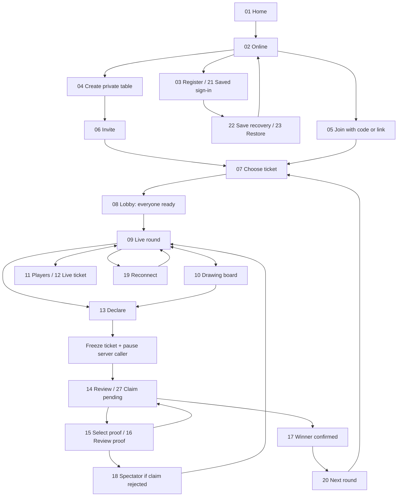

# Screen specification and decisions

This is the behavioral source for the v1 images. Screens are numbered consistently with the seven boards. **All default limits and disputed gameplay choices below are proposals for design lock.**

## Flow

Registration is required before table creation, membership or game data access. A deep link preserves the pending invite across registration/restoration, then asks the user to join the resolved table. Existing authenticated users skip registration.

## Screen-by-screen contract

| # | Screen | Main interaction and state |
| --- | --- | --- |
| 01 | Home | Play online is visible alongside Offline caller; existing settings, account and share remain available. Offline play still requires no sign-in. An active table adds a resume entry. |
| 02 | Online hub | Private is available. Public is visible, disabled and labelled Coming soon. Create and Join are separate actions. Server also rejects public creation in v1. |
| 03 | Player registration | Name + country/mobile + avatar initials. Android SIM hint is optional. Clearly self-declared number; table disclosure acknowledgement. Registration uses a device credential, never phone-only login. Validate missing name/invalid number inline. |
| 04 | Create table | Table name, private/public visibility, winning pattern and call interval. Private default; public disabled. Proposed starting rules: full house and 8-second calls. Existing default speed/voice preferences may prefill compatible choices. |
| 05 | Join table | A six-digit table code, with paste/autofill and leading-zero support. Resolve to a minimal table preview, then explicit Join. Name/mobile/tickets stay hidden until authenticated membership. A valid invite link enters this same flow. |
| 06 | Invite friends | Readable code, copy link and native share sheet. Host can rotate/revoke invitation. Sharing invokes the user's chosen app; no automated messages. Successful copying gets an accessible confirmation. |
| 07 | Ticket choice | Server generates a valid 3×9 ticket. Regenerate freely, subject to abuse limits. Use this ticket selects one revision for the upcoming round. Regenerating unsets readiness. No paid tickets. |
| 08 | Lobby | Avatar tiles, host/self labels and Choosing/Ready/Reconnecting. Show n/N ready. Ready is reversible while waiting. Ticket/rules/roster changes reset relevant readiness; rules changes reset everyone. All participating players must be ready and connected before the countdown. |
| 09 | Live game | Server's latest number + count/history, own ticket, live avatar rail and declaration action. Sound controls are local. No client Next-number button online. Drawing is manual; no automatic daubing. |
| 10 | Drawing board | Pen, marker, eraser, undo, color and stroke size; zoom/pan and persistent latest call/Declare. Show Saving/Saved/Reconnecting accurately. Editing never changes the printed ticket. Tap marking is an accessible alternative. |
| 11 | Participants | Meeting-like list of all admitted members, host/self, connection and round status. Tapping a row opens the member's profile and live ticket. No audio/video meetings are implied. |
| 12 | Profile + live ticket | Name, admitted-table phone disclosure, avatar and real-time ink updates. Read-only for viewers; only the owner edits. Label stale data after connection loss. Activity “marked 46” only follows an explicit semantic tap-mark, not inferred handwriting. |
| 13 | Declaration confirmation | Available from game/editor at any time during an active round. Select a configured pattern and confirm. Explain pause and false-claim consequence. Cancel returns to play. A claim must not be disabled because client-side logic thinks it is invalid. |
| 14 | Review claim | Notify all players; pause calling. Show immutable claim-time ticket/ink and the matching called-history version. Everyone else gets Looks correct or Challenge with proof. Show reviewer progress. |
| 15 | Proof selection | Highlight area with rectangle/lasso or choose specific cells; reason + optional brief note. Compare against claim-time calls. Publish proof to the whole table. Text/cell selection works without precise drawing gestures. |
| 16 | Review proof | Everyone sees the same evidence area, challenger and reason. Agree with proof / Dispute evidence; reviewer identities and status are visible. One challenge cannot unilaterally expel someone. |
| 17 | Winner | Full house confirmed only after required review. Show winning ticket and round summary; return to table for another round. This is an alternative to screen 18, not the next state after a rejected claim. |
| 18 | Spectator | Rejected claimant watches the remainder of this round. No drawing, new claim, ticket replacement or re-entry as active player. Can inspect live tickets/calls; returns to eligibility next round. Everyone receives the result and caller resume status. |
| 19 | Reconnecting | Keep last confirmed state visibly stale. Disable claims/ready while offline; retry and catch up. Preserve seat/status. Never falsely show the whole table as paused because one client loses connection. |
| 20 | Next round | New round ID, fresh ticket selection and all readiness reset. Former spectators may play again. Late joiners can now enter the participating roster. Invite may stay valid while table is open. |
| 21 | Saved sign-in | Use a saved device credential to resume the same player. Show restore/existing-account choices when needed. Never open a profile by mobile number alone. |
| 22 | Recovery secret | Copy/save acknowledgement before leaving this screen. Secret differs from shared table code. The displayed grouped Xs are illustrative. Do not broadcast or log the secret. |
| 23 | Restore profile | Validate recovery secret; rotate it after use. Invalid/used/expired credentials get actionable errors without exposing account data. Existing username/password sign-in remains available. |
| 24 | Invite unavailable | Expired, revoked, malformed or unknown invite; allow new code or return online. Similar inline variants cover full/closed table. If round is running, offer Join as spectator for next round. |
| 25 | Called numbers | Grid of 1–90, chronological view, latest highlight and number lookup. Each number appears once. In review, visibly label “At declaration”; it must not show a later live history. |
| 26 | Table controls | Invite actions and rules. Host-only controls; edits apply next round once running. Rotate invite confirmation explains old code/link invalidation. Closing a table needs a separate destructive confirmation. |
| 27 | Claimant waiting | Frozen own ticket, per-reviewer status and called-history access. No self-vote, duplicate claim or editing. New challenges arrive here and can be inspected. |
| 28 | Leave confirmation | Rejoin retains same round status/ticket; leaving cannot clear disqualification. Transfer host control deterministically if the host leaves. Closing the table is a separate action. |

## Readiness and round rules

Proposed v1 capacity: 2–12 active players, one ticket per player per round. Spectators do not hold up the next start unless they join its active roster. Everyone in that active roster, including a playing host, readies up. A short countdown begins only after a server-side recheck. A join, disconnect, ticket change or rule change during the countdown cancels it.

Ticket selection locks atomically at the start of the round. During a round, new arrivals watch and wait for the next one. A returning member resumes the same ticket and eligibility. Table invite is reusable while valid; the user's “OTP” is therefore labelled “table code” rather than falsely described as single-use.

Proposed initial winning pattern: full house, all 15 ticket numbers called. The pattern selector can expand to rows/early five later, but those rules need separate acceptance criteria before inclusion.

## Claim resolution proposal

1. Declare flushes/acknowledges the claimant's pending ink operations, then captures an immutable ticket, ink revision, selected pattern and called-number sequence on the server.
2. Atomically pause calling and invalidate the next draw's generation. Clients show a paused banner and stop queued announcements.
3. Freeze reviewers from the round roster, excluding claimant. Proposed eligibility includes earlier round participants who now spectate; late-join spectators cannot vote.
4. Every reviewer can approve or submit proof. Store one current decision per reviewer per claim/evidence version. New evidence requires explicit reconsideration, so previous approvals cannot resolve a different evidence set.
5. A server check independently determines whether the selected pattern's printed numbers are in the called set. It supports discussion; it does not pretend to understand arbitrary handwriting.
6. A valid claim with unanimous approval confirms the winner. A supported false claim with unanimous evidence agreement rejects the claim and changes the claimant to spectator for this round.
7. Pure ink/marking disagreements without objective number evidence require collective review, not automatic image recognition. Unsupported/malicious challenges do not automatically disqualify anyone.
8. Proposed unresolved policy: after 60 seconds, show who's missing and offer another review window or an agreed “End round without a winner.” Never turn silence into approval or give the host an invisible deciding vote. If nobody responds, expire the abandoned table after its idle timeout. Exact timeout/voting fallback needs design lock.
9. Simultaneous declarations at the same called sequence are captured and reviewed in server order while calling remains paused; support shared winners for valid full-house claims at that same sequence. If all claims are rejected, resume with remaining active players. With no eligible players or no remaining numbers, finish without an unverified winner.

## Drawing behavior

Ink is a transparent layer over a server-owned ticket. Store vector strokes in normalized ticket coordinates, with stroke IDs, point batches, tool/color/width and erase/undo operations. Structured cell marks are a separate layer. Do not equate “a red pixel touches a cell” with a verified mark.

Normal drawing is immediately local and then acknowledged by the server. Followers see accepted operations. The owner can undo only their operations. Claim snapshots reference the exact accepted revision; later ink cannot rewrite evidence. During review freeze gameplay edits for the round to keep the shared state understandable; restore editing only for eligible players when play resumes.

## Design system and accessibility

Retain plum #290435, violet #76207d and gold #efd080 from the existing identity. Use ivory paper and dark text for tickets and long reads. Prefer clean sans-serif body text and restrained display headings; decorative generated taglines are not final copy.

Use 44–48dp controls, clear focus order, readable dynamic text, accessible modal focus and number announcements, reduced-motion support, and text/icons alongside state colors. Ticket cells at phone width are small: provide zoom, landscape support and a number-list marking alternative. Do not force the 9-column ticket into 44dp cells on a narrow phone without a zoomable surface.

Add loading, empty, pending-save, failed-save, duplicate-action, disconnected and revoked-session states to each affected component. Important game status should remain visible without sound.

## Design-lock decisions

| Decision | Proposed direction | Why it needs validation |
| --- | --- | --- |
| Visual treatment | Plum/gold + ivory paper; board 03's readable body styling | Generated boards have small typography/chrome variations; standardize before implementation |
| Mobile identity | Device credential + self-declared mobile; optional Android hint | Meets no-SMS scope, does not establish phone ownership |
| Full mobile visibility | Explicit acknowledgement before private-table entry; disclose only to admitted members | Matches requested profile detail; decide whether masking should instead be offered |
| Claim consensus | All other round members review; evidence needed for rejection | Prevents one accidental or hostile tap from deciding a result |
| Unresolved reviews | Visible timeout and no automatic winner | Disagreement/disconnect fallback changes game fairness |
| Scope/defaults | Full house, 2–12 players, 8 seconds, one ticket | Product defaults were not specified in the request |
| Late join/simultaneous claims | Watch until next round; shared winners at same called sequence | Avoids late ticket selection and network-speed-only wins |

## Image QA notes

All seven boards were inspected. Boards 02 and 04 were corrected to remove invented global navigation and claimant self-voting. Screen 25 shows representative colored cells; its “43 called” label is illustrative and is not a mathematically validated fixture. The implementation must derive every count/highlight from the same server array. Sample tickets/avatars represent different states and alternatives, not a literal replay. Production rendering must use the ticket validator; decorative home artwork is not a playable ticket.
