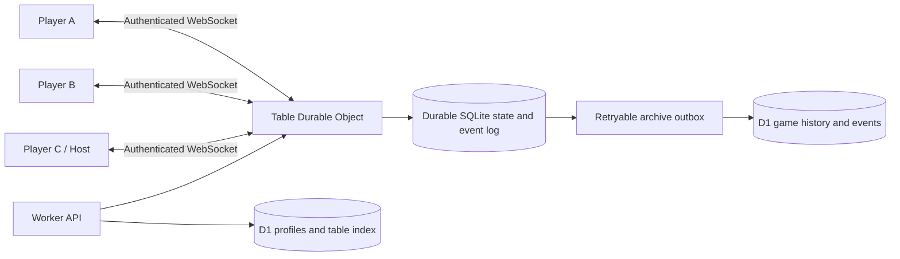

# Tambola Circle — implementation plan

Final design handoff · 21 September 2026 · Version 2

Build private online Tambola for friends and family around tall ticket strips, simple tap-to-circle marking, server calls, timed community reviews and a final host decision. The product name is **Tambola Circle**. Public tables appear disabled as “Coming soon.”

This is the implementation baseline, not a claim that the feature has shipped. The finalized deliverable includes 36 generated screen concepts in nine boards, [screen behavior](SCREEN_SPEC.md), [rules and timing](RULES_AND_TIMERS.md), and [device feasibility](PHONE_FEASIBILITY.md). It supersedes every conflicting v1 design, including the earlier 60-second review suggestion.

## 1. Locked product behavior

| Area                 | Final design                                                                                            |
| -------------------- | ------------------------------------------------------------------------------------------------------- |
| Home                 | Play online, Offline caller, My tables, Settings, Account                                               |
| Table visibility     | Private supported; Public visible but disabled                                                          |
| Joining              | Server-issued short table code or revocable share link, followed by device sign-in where required       |
| Identity             | Name + supported device-selected SIM number; no editable phone field, no SMS OTP flow, no recovery code |
| Half / Full          | 3 / 6 panels; 3×9 cells and 15 numbers per panel; full house claims one panel                           |
| Selection            | Server-generated candidate strips; regenerate until ready or deadline                                   |
| Ready time           | Host-configurable, default 120 seconds per member/attempt; unready players watch                        |
| Start                | At least two active participants; every active participant explicitly ready                             |
| Lobby                | All members visible; tap ready users to view their strip; own tickets behind My tickets                 |
| Live screen          | Pinned call, left call-history rail, right player rail, tall scrolling strip, per-panel Win             |
| Marking              | Tap a number toggles one circle; synced to server and other members                                     |
| Claim/proof review   | Same host-configurable review time, default 120 seconds each; unanswered votes approve on expiry        |
| Disagreement         | Immediately goes to effective host; decision final for that round                                       |
| Final decision limit | Same review duration; expiry without a host decision ends round without winner                          |
| False claim          | Claimant becomes spectator for current round and can return next round                                  |
| Ownership            | Permanent transfer; appointed co-host temporarily takes over on owner disconnect                        |
| Return               | Owner explicitly reclaims host; same round/marks/deadlines continue                                     |
| Persistence          | All accepted game events/history saved; resumable ongoing tables; no automatic short event-log deletion |

The extra finalization choices—minimum players, per-panel full house, ready-timeout spectators, host-decision expiry, timing bounds and conflict-of-interest handling—are explicit in [RULES_AND_TIMERS.md](RULES_AND_TIMERS.md). They close gaps without creating more approval questions.

## 2. Repository study using Atlas

Atlas was queried before code searches/reads. It reports a local Expo/React Native application and a Cloudflare Worker/D1 account service. There is no implemented authoritative multiplayer room coordinator in the cited application code. Generated Worker type declarations are not evidence of a room implementation.

| Current code                                                                                                   | What is reusable / what must change                                                                                                                                                                |
| -------------------------------------------------------------------------------------------------------------- | -------------------------------------------------------------------------------------------------------------------------------------------------------------------------------------------------- |
| [App.tsx:13](../../App.tsx#L13) — TambolaApp                                                                   | Local home/caller routing, local draw timer and app-background pause. Add an isolated online flow; the online caller must never use this local timer as authority. Update branding and share copy. |
| [HomeScreen.tsx:30](../../src/components/HomeScreen.tsx#L30)                                                   | Existing offline start/resume and settings/account entry. Add the prominent online option and ongoing table entry.                                                                                 |
| [CallerScreen.tsx:18](../../src/components/CallerScreen.tsx#L18)                                               | Reuse useful call presentation conventions, not local online state ownership.                                                                                                                      |
| [Artwork.tsx:28](../../src/components/Artwork.tsx#L28), [Artwork.tsx:56](../../src/components/Artwork.tsx#L56) | Decorative ticket and plum/gold backdrop. Decorative artwork is not a valid ticket generator. Replace branding assets with Tambola Circle assets.                                                  |
| [game.ts:4](../../src/game.ts#L4), [game.ts:19](../../src/game.ts#L19)                                         | Without-repeat draw helper and rejection-sampling integer helper inform server equivalents. Create a separate strip generator with tested structural invariants.                                   |
| [useAppState.ts:8](../../src/useAppState.ts#L8)                                                                | Guest/account/preferences lifecycle. Introduce a separate online membership/session layer and migration path.                                                                                      |
| [storage.ts:43](../../src/storage.ts#L43)                                                                      | Native identity currently uses SecureStore with device-only accessibility; web fallback uses AsyncStorage. Use device-protected credentials for the new native online flow.                        |
| [server/src/index.ts:77](../../server/src/index.ts#L77)                                                        | Existing hashed-session handling provides a starting point for session issuance/rotation.                                                                                                          |
| [server/src/index.ts:84](../../server/src/index.ts#L84)                                                        | Guest, username/password, recovery and preference routes. Add versioned device/room APIs; do not expose the legacy recovery flow in the new UI or silently invalidate existing users.              |
| [useVoice.ts:9](../../src/useVoice.ts#L9)                                                                      | Voice playback can announce authoritative call events after sequence deduplication.                                                                                                                |

These links are repository-relative for portability. Atlas source evidence is saved in [atlas-evidence.json](atlas-evidence.json). Re-query Atlas before implementing because the user's working tree may evolve after this design handoff.

## 3. Architecture

Use one SQLite-backed Cloudflare Durable Object per table. It owns the table state machine, accepted command order, ticket selection, all calls, deadlines, votes, roles and a durable event log. The existing Worker authenticates REST/WebSocket requests and routes them to the table object; D1 stores profiles, session metadata, table membership indexes and the durable history projection.

The requested peer experience is **server-mediated multiplayer**: each device communicates with the authoritative table server, which fans out updates to the other devices. This is a WebSocket client/server topology, not a direct WebRTC peer mesh. A direct mesh adds no required capability here and cannot be the source of truth.



Use hibernation-aware WebSocket handling, authenticated attachments and reconstruction from persisted data. Durable Object alarms support retries and therefore require idempotent transitions; schedule the nearest due deadline through one alarm dispatcher. [Cloudflare WebSocket guidance](https://developers.cloudflare.com/durable-objects/best-practices/websockets/) and [alarms](https://developers.cloudflare.com/durable-objects/api/alarms/).

Do not depend on the host's phone, a connected browser, a client interval, a heartbeat received exactly on time, or a remote push service to advance a round. A disconnected host does not pause calls. A claim intentionally pauses calls until its bounded review ends.

## 4. State machine and durable deadlines

Persist this round state:

```text
LOBBY -> LIVE -> CLAIM_REVIEW -> ROUND_FINISHED
                    |
                    v
               PROOF_REVIEW -> LIVE (claim rejected)
                    |
                    v
               HOST_DECISION -> ROUND_FINISHED (claim accepted)
                    |       -> LIVE (claim rejected)
                    +------ -> ROUND_FINISHED_NO_WINNER (deadline)
ROUND_FINISHED* -> new LOBBY attempt
```

LOBBY has per-member ready deadlines. All phases carry immutable config snapshots, startsAt/deadlineAt, stateVersion and roundId. Round transitions check stateVersion and resolve due deadlines before accepting incoming actions. Call and claim races resolve in one committed sequence.

The deadline dispatcher handles:

- each readiness expiry;
- next call while live;
- claim/proof expiry and explicit timeout votes;
- host decision expiry;
- presence-lease expiry and temporary co-host takeover;
- final post-90th-call claim opportunity.

Persist draw order/cursor or equivalent reproducible history. If an alarm is late, resolve phase deadlines using the stored timestamps; do not burst a backlog of numbers at returning users. While live, draw at most the next scheduled call and schedule the following visible interval from the committed call time. Restore reviews exactly from persisted deadlines. A delayed worker changes delivery latency, not who had a valid vote before expiry.

The detailed transition contract, including claim freezes and no-winner fallback, is in [RULES_AND_TIMERS.md](RULES_AND_TIMERS.md).

## 5. Data model and history

Suggested logical tables (names may be adjusted to existing migration conventions):

| Store                       | Main entities                                                                                                                                                                                   |
| --------------------------- | ----------------------------------------------------------------------------------------------------------------------------------------------------------------------------------------------- |
| D1 identity                 | users(id, display_name, mobile_e164, mobile_source, verification_status, consent_at), devices(user_id, public_key_or_credential_hash, revoked_at), sessions                                     |
| D1 table directory          | tables(id, name, visibility, owner_id, config_version), memberships(table_id, user_id, membership_status, last_seen_round_id), invite_tokens(hashes, expires_at, revoked_at), active code index |
| Per-table SQLite            | table_state, members, round_attempts, rounds, round_members, strip_candidates, selected_strips, ticket_panels, cell_marks, calls                                                                |
| Per-table SQLite reviews    | claims, frozen_claim_snapshots, proofs, review_electorates, votes, host_decisions                                                                                                               |
| Per-table SQLite durability | events(seq, event_id, schema_version, round_id, actor_id, type, payload, server_time), command_dedup, archive_outbox, snapshots                                                                 |
| D1 archive                  | completed/ongoing round summaries, full event archive, selected ticket/mark snapshots, claim/proof/decision records, table-role history                                                         |

For every accepted domain command, transactionally update state, append the event and outbox record, then acknowledge and broadcast the committed sequence. A D1 archive failure must not lose an acknowledged mark or stop a healthy room. Retry the outbox idempotently by (tableId, eventSeq). Do not call two independent writes “atomic.” Keep the Durable Object source history until the archive is verified; compaction adds snapshots without deleting requested event history.

Persist calls, mark/unmark actions, ticket selection/regeneration/ready changes, joins/leaves/reconnections, claim snapshots, proofs, votes, timeout outcomes, role grants/reclaims/transfers, kicks, setting changes and round outcomes. Record rejected/stale command diagnostics separately with reason and correlation IDs; never log credential bodies or phone numbers in general telemetry.

Store mobile/name in the profile database, not repeatedly in every event. Events refer to user IDs; history can preserve a display-name snapshot if needed. Table members may view a member's name and phone after the sharing disclosure, but membership authorization applies to every profile/ticket endpoint. Kicked users and unrelated users cannot query the table.

There is **no seven-day history TTL** or automatic gameplay-event purge in this design. Partition/index/archive as volume grows. Storage budgets, backups and explicit future deletion policy need operational design; do not silently discard history to reduce costs.

## 6. Commands, events and reconnect protocol

Example command envelope:

```json
{
  "commandId": "client-generated-unique-id",
  "tableId": "table-id",
  "roundId": "round-id",
  "expectedStateVersion": 81,
  "lastSeenEventSeq": 204,
  "authorityEpoch": 4,
  "type": "SET_MARK",
  "payload": { "panelId": "panel-2", "cellId": "r2c4", "marked": true }
}
```

Use SET_MARK with explicit desired state rather than an unsafe duplicate-sensitive toggle command. The UI can visually toggle, but retries preserve the original desired state and commandId. Each cell version resolves multiple-device conflicts; stale writes get a resync instead of reversing a newer mark.

Commands: CREATE_TABLE, JOIN_TABLE, SELECT_STRIP_TYPE, REGENERATE_STRIP, CONFIRM_STRIP, SET_READY, SET_MARK, DECLARE_FULL_HOUSE, SUBMIT_PROOF, CAST_REVIEW_VOTE, HOST_DECIDE, APPOINT_COHOST, TRANSFER_OWNER, RECLAIM_HOST, REMOVE_MEMBER, CHANGE_NEXT_ROUND_SETTINGS, LEAVE_TABLE and START_NEXT_ATTEMPT.

Events include serverTime, tableId, roundId, seq, stateVersion and typed payloads. Clients receive only committed events. Broadcast presence/role changes and player marks; use snapshots when a sequence gap occurs. Limit event payload size, number of proof regions, notes and request rates. Validate all cells, ownership, membership and phase transitions on the server.

On reconnect:

1. Authenticate the existing device/session and membership.
2. Fetch the authoritative snapshot and events after lastSeenEventSeq, or a new snapshot if the local cursor is too old.
3. Restore the same strip, circles, latest call, complete call history, remaining deadlines, current role and spectator/active state.
4. Reconcile unacknowledged command IDs against the dedup store. Show local unacknowledged marks as pending, never as committed proof.
5. Reject stale mark/claim/vote operations if the phase changed. Do not replay an offline declaration or vote into a new phase.
6. Preserve the strip scroll position where possible, but direct a reviewer to the claimed panel.
7. If the round ended while away, show its recorded result and the next lobby.

Calls are paused for all claim/proof/host-review phases. Ordinary player editing is locked during those phases so claim evidence cannot drift; proof selection is a separate read-only overlay. The claim includes only the server-confirmed marks and calls. “Saved” means server-acknowledged; offline stale tickets visibly say “Last synced.”

## 7. UI implementation

Create a separate online feature module rather than expanding App.tsx into every screen.

Proposed modules:

- src/online/navigation and screens: entry, SIM onboarding, create/join/invite, lobby/chooser, live, claim/proof/host review, member details, management, history.
- src/online/components: TicketStrip, TicketPanel, TicketCell, CallHeader, CallsRail, PlayersRail, DeadlineBadge, ConnectionNotice, ReviewActions.
- src/online/state: server event reducer, snapshot reconciliation, command queue/dedup tracking, presence and server-clock offset.
- src/online/native: supported SIM-selection adapter, device credential storage, Android immersive-mode bridge if the selected Expo APIs need it.
- server/src/tables: authoritative coordinator, command handlers, deadline dispatcher, strips, claims, role leases, persistence/outbox.
- server migrations: identity/device additions, directory/history schema and Durable Object binding migration.

Use the same ticket renderer for chooser, lobby viewing, live, proof, host decision and history. Pass read-only/markable/evidence modes explicitly. A normalized cell coordinate identifies proof, avoiding different phone dimensions changing the accusation.

On live play, target a compact 88–116 logical-pixel call header on a normal portrait phone; devote the remainder to the strip, with only necessary safe cutout spacing. Left/right handles open overlays and do not permanently narrow every cell. Preserve at least a 44–48 logical-pixel accessible target where practical; on narrow screens use zoom/landscape/scroll rather than tiny unreadable tickets. Never shrink a full strip to fit six panels on one screen.

Hide Android status/navigation bars during live and ticket-review surfaces, restore their previous visibility on exit, and respect system gestures, cutouts, accessibility and back navigation. Android can transiently reveal system bars, so “hidden” is not a guarantee against OS gestures. Validate Expo 57 edge-to-edge behavior on real devices; use a native bridge if required. [Android immersive mode](https://developer.android.com/develop/ui/views/layout/immersive), [Expo navigation bar](https://docs.expo.dev/versions/latest/sdk/navigation-bar/).

Use in-app foreground claim notifications/banners for all table members. Background push is a later optional delivery feature and cannot decide votes or deadlines. Voice announces only newly committed live call events, not an entire replay backlog.

## 8. SIM selection and account constraints

Android Phone Number Hint is a candidate for a user-consented selection of a SIM-based number. It is not a guaranteed SIM inventory or ownership proof. iOS currently has no confirmed general native SIM-number picker matching the no-input requirement. Unsupported or unavailable device selection shows the designed blocked-online state, with Retry, saved invite and Offline caller.

The native feasibility spike is a **release gate for online registration**, not a reason to invent manual phone entry. Store the selection as device_selected/unverified. Use a device credential/session for authentication. Do not grant access to an existing user merely because a device reports their phone number. Number metadata alone cannot safely recover an account.

Same-device sign-in persists while its protected credential remains. Cross-device/reinstall restoration is explicitly deferred, because the user excluded recovery codes and has not selected an alternative proof of ownership. Existing account migration must be designed separately and tested before hiding legacy entry points. See [PHONE_FEASIBILITY.md](PHONE_FEASIBILITY.md) for current primary sources and the test matrix.

## 9. Delivery phases and completion gates

| Phase                         | Deliverables                                                                                                                       | Exit criteria                                                                                                                   |
| ----------------------------- | ---------------------------------------------------------------------------------------------------------------------------------- | ------------------------------------------------------------------------------------------------------------------------------- |
| 0 — feasibility and contracts | Native Android/iOS SIM probe; device credential design; strip/rules schema; immutable deadline/role model; immersive-mode probe    | Document actual device support, consent/native picker behavior and unsupported outcomes; no falsely verified phone claim        |
| 1 — entry and durable tables  | Rename visible branding, home online entry, private create/join, code/link, device session, member directory, table settings       | Only private creation allowed server-side; invite resumes after sign-in; existing offline caller still works                    |
| 2 — tickets and ready lobby   | Valid Half/Full strips, regeneration, chooser, per-player deadlines, ready locking, ready-player viewer                            | Two phones see the same members/strips; every starter clicked ready; timeout spectators; no replay exploit resets time          |
| 3 — multiplayer play          | Durable table object, server caller, tap circles, rail drawers, member profile, read-only live views, immersive layout             | 2–12 active clients see ordered calls/marks; reconnect keeps same ticket and saved marks; host disconnect does not stop calls   |
| 4 — claims and proofs         | Frozen snapshots, claim/proof timers, automatic timeout votes, evidence selection, host final decision, false-claim spectator mode | Every branch terminates; exact-deadline races deterministic; no post-claim ticket correction; timeout method visible in history |
| 5 — ownership and return      | Co-host lease takeover, reclaim, permanent transfer, kicks, ongoing tables, outbox/archive, event log and replay                   | No dual effective host; no resetting timers through transfer/reclaim; complete history survives process/connection loss         |
| 6 — release hardening         | Accessibility, multi-device endurance, archive retry/load checks, account migration, supported-device messaging                    | Release checklist below passes and actual native SIM support is honestly scoped                                                 |

Suggested initial table capacity is 2–12 active players, plus bounded spectators. This is an engineering starting point to confirm with load measurements, not a claim about current platform limits. The design supports expansion without changing its room-authority model.

## 10. Meaningful validation

Use existing repository check/typecheck/test/test:api/export scripts where still applicable after Atlas revalidation. Add tests for real state and concurrency risks rather than snapshots that simply mirror implementation.

- Ticket property tests: 3×9 shape, five numbers per row, 15 unique per panel, correct column ranges/ascending order, full strip exactly 1–90, half exactly three valid panels; candidate ownership and locked selection.
- Fake-clock state-machine tests: every ready/claim/proof/host boundary at deadline-minus-one, exact deadline and after; retries/delayed alarms; configurable durations; config changes never rewrite active deadlines.
- Multiplayer integration: two/twelve clients, draw-vs-claim ordering, late join vs start, duplicate SET_MARK, event gaps, missed ACK then reconnect, two devices for one user, forged foreign-ticket edits.
- Review decisions: explicit unanimous approval, mixed explicit/timeout votes, claimant proof agreement/disagreement, host override with audit facts, no available host, frozen electorate, stale proof submission, finite serial-claim behavior.
- Role transitions: owner timeout/co-host takeover, owner return without reclaim, reclaim, permanent transfer then old-owner return, conflicting admin epochs, acting host kick, review deadline unchanged.
- Durability: restart between commit and broadcast, duplicate alarms, D1 archive outage, retry backlog, full rehydration, completed and ongoing history, no acknowledged events lost.
- Native devices: Android dual SIM/eSIM/no SIM/no Google Play Services/cancelled picker/missing number, app killed and reopened, unsupported iOS path, system bar gestures, back navigation, small phones and screen readers.
- Security/privacy: authenticated and authorized room membership, brute-force-resistant short code joining, link revocation, rate limits, protected session storage, no credentials/phone leakage in public invites or event telemetry.

This design handoff itself changes documents and image assets only. Production checks above must run during implementation; they have not been claimed as passed now.
